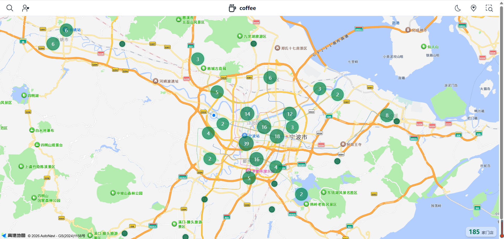

[[toc]]

Coffee网页的设计灵感来自于一个普通的在星巴克喝咖啡的下午，突发奇想能不能把全国的星巴克门店都整合到一起，用地图可视化的形式展示门店分布密度，为咖啡爱好者提供便捷的门店查询和导航服务。

于是<GitHubLink name="JoiePink/Coffee" repo="/JoiePink/Coffee"></GitHubLink>便诞生了。

技术栈：{Vue} {Amap} {UnoCSS} {Icônes} {Vant} {ESLint} {Vite}

</img>

痛点：本项目有`8000+`的数据量，需要在高德地图上点标记每家星巴克门店且支持交互，由于数据量过大，首次进入页面`加载速度很慢`，且把8000+点标记显示在地图上，点标记的交互动作会`崩盘`，地图操作`响应速度也会变慢、卡顿`，非常影响用户的`使用体验`。

基于此，我从以下几个方面对项目进行了性能优化

1. **Amap SDK按需、动态加载**
2. **用 shallowRef 存地图相关实例**
3. **点聚合 + 只渲染视野内点位**
4. **视口变化防抖 + 只绑一次**
5. **首屏后再拉数据**
6. **主题切换与地图样式**

## 1. Amap SDK按需、动态加载

在地图页面的js中，我并不在js顶部写`import AMapLoader from '@amap/amap-jsapi-loader'` 。

这种使用方法有两个弊端：

第一方面，在[Vite](https://github.com/vitejs/vite)打包的时候，这个依赖会被打包进入首屏就要加载的bundle(主chunk或和主入口一起被加载的chunk)，用户第一次打开页面的时候，浏览器就会一起下载这份包含高德的JS,导致首屏体积变大，加载速度变慢。

第二方面，这种方式在模块被`Node`执行的时候就会运行，于是会加载`@amap/amap-jsapi-loader`及其内部依赖, 而[Amap](https://lbs.amap.com/)内部SDK/loader会用到`window`，但是`Node`里面是没有`window`的，所以会导致报错(例如 `Reference Error: window is not defined`)。

为了避免以上两种问题，我在初始化[Amap](https://lbs.amap.com/)的函数里写`const {default: AMapLoader} = await import('@amp/amp-jsapi-loader')`，这个函数只在`onMounted`生命周期中调用，也就是说只在浏览器里、页面挂载之后才会执行

在[Vite](https://github.com/vitejs/vite)打包的时候，`@amap/amap-jsapi-loader`会被打包成单独的`chunk`，只有执行到`const {default: AMapLoader} = await import('@amp/amp-jsapi-loader')`的时候才会加载这段JS，首屏主bundle里并没有[Amap](https://lbs.amap.com/)相关代码，所以首包更小、首屏更快。

SSG时Node不会执行`onMounted`钩子，所以不会执行这段`import`，自然也就不会在Node里加载高德，不会碰到`window`，避免了报错。

```js
async function initMap() {
  const { default: AMapLoader } = await import('@amap/amap-jsapi-loader') // [!code hl]
  const amapKey = import.meta.env.VITE_AMAP_KEY
  if (!amapKey)
    return Promise.reject(new Error('Missing VITE_AMAP_KEY'))
  window._AMapSecurityConfig = { securityJsCode: amapKey }
  return AMapLoader.load({
    key: amapKey,
    version: '2.0',
    plugins: ['AMap.Scale', 'AMap.MarkerCluster', 'AMap.Geolocation'], // [!code hl]
  })
}
```

在`initMap`函数中，我使用[Amap](https://lbs.amap.com/)2.0的`按插件加载`特性，通过`AMapLoader.load({plugins: [...]})`按需加载需要的插件，这种方式在项目中精准引入需要使用的插件，使得项目请求更少、解析更少、地图初始化更轻，从而加快了加载速度、减小了打包的包体积。

## 2. **用 shallowRef 存地图相关实例**

```js
const map = shallowRef(null)
const currentLocationMarker = shallowRef(null)
const geolocation = shallowRef(null)
const Amap = shallowRef(null)

/** 根据 isDark 设置地图底图样式；返回 Promise，地图样式切换完成后再 resolve */
function applyMapStyle() {
  if (!map.value)
    return Promise.resolve()
  const style = i
  sDark.value ? 'amap://styles/dark' : 'amap://styles/normal'
  return new Promise((resolve) => {
    nextTick(() => {
      map.value?.setMapStyle(style)
      setTimeout(resolve, 1800)
    })
  })
}

/** 点击切换主题 */
function onThemeToggle() {
  themeChanging.value = true
  nextTick(() => {
    toggleDark()
  })
}

/** 监听 isDark，切完样式再关 loading */
watch(isDark, () => {
  const p = applyMapStyle()
  if (p) {
    p.finally(() => {
      themeChanging.value = false
    })
  }
  else {
    themeChanging.value = false
  }
})
```

先来说一下[Vue](https://github.com/vuejs/core)中<code important-text-cyan>ref</code>和<code important-text-cyan>shallowRef</code>的区别

<code important-text-cyan>ref</code>: [Vue](https://github.com/vuejs/core)会对你塞进去的整个对象做深度响应式代理——递归的把对象里每一层属性都报称getter/setter(Proxy), 这样任意一层属性变了都会触发更新

<code important-text-cyan>shallowRef</code>：只对[.value这一层]做响应式。当把一个对象赋值给`shallowRef.value`的时候，[Vue](https://github.com/vuejs/core)不会去递归代理这个对象内部，内部属性变了[Vue](https://github.com/vuejs/core)并不知道，但只有把整个对象换掉(重新赋值.value)时候才会触发更新

如果使用<code important-text-cyan>ref</code>来存储[Amap](https://lbs.amap.com/)实例，会出现<code important-text-purple>因深度代理造成的postMessage克隆报错</code>，例如：DOMException: Failed to execute 'postMessage' on 'Worker': AMap.Map#xxx could not be cloned.

[Amap](https://lbs.amap.com/)的实例如`Map` `Marker` `Geolocation` `MarkerCluster`等内部会用到`postMessage`例如和地图iframe/worker通信

浏览器在发`postMessage`的时候，会对要传的数据做<code important-text-purple>结构化克隆 structured clone</code>，把对象序列号之后再在另一边反序列化，而Proxy对象不支持被克隆，所以会报错

能被结构化克隆的：普通对象、数组、部分简单类型

不能被结构化克隆的：函数、DOM节点、Proxy对象(Vue的响应式对象就是Proxy)

如果使用<code important-text-cyan>shallowRef</code>存储的话，赋值给`shallowRef.value`的是[Amap](https://lbs.amap.com/)原始的实例对象，[Vue](https://github.com/vuejs/core)不会去递归代理它里面的属性，也就不会报错。而<code important-text-cyan>ref</code>存储会递归遍历、创建大量的`Proxy`，但其实并不需要在地图内部某个坐标变了就触发Vue更新，我们只需要在换地图、换marker、换聚合的这种`整实例替换`的时候更新即可。所以<code important-text-cyan>shallowRef</code>的时候内存和CPU开销都更小，从而最性能有利。

### 3. **点聚合 + 只渲染视野内点位**

为了解决数据量过大导致DOM数量巨大(每个门店创建一个marker标记)导致卡顿崩盘的问题，我使用[Amap](https://lbs.amap.com/)的<code important-text-yellow>点聚合 MarkerCluster</code>将距离近的一批点在逻辑上归为一组，地图上只画一个聚合点，用户放大地图时，聚合会拆开变成更小的簇或者单点，缩小地图的时候，会合并成更大的簇。

即使使用<code important-text-yellow>点聚合 MarkerCluster</code>，如果把全国所有门店(8000+)的数据量一次性都塞给<code important-text-yellow>点聚合 MarkerCluster</code>，聚合算法要对这所有点都做距离计算、分簇、计算量十分之庞大，而绝大部分点并不在当前用户所见的屏幕内，用户根本看不到，却还是在耗费后台进行参与计算和内部管理，所以，更合理的做法是只把<code important-text-yellow>当前视野 current viewport</code>内的点标记交给<code important-text-yellow>点聚合 MarkerCluster</code>进行计算，而视野外的点不参与计算和渲染，当用户拖动地图画布或者放大缩小当前视野的时候，再进行计算参与。

具体做法如下：

</img>

### 4. **视口变化防抖 + 只绑一次**

当用户拖拽、缩放地图的时候，地图会连续触发很多次`moveend/zoomend`的事件，如果每次触发都执行上文的`updateClusterByViewport`方法，计算执行过于频繁，容易造成页面卡顿、浪费CPU，因此为这些操作都加上防抖

```js
const onViewportChange = useDebounceFn(() => updateClusterByViewport(Amap.value), 150)
map.value.on('moveend', onViewportChange)
map.value.on('zoomend', onViewportChange)
```

### 5. **首屏后再拉数据**

首屏加载的时候，应该把注意力放在地图容器快速渲染上面，从而给用户一个比较好的使用体验。而加载数据(`loadAndRenderStores`)会执行请求数据、处理数据、渲染视野内点聚合这一系列操作，逻辑较重，因此如果在地图还没准备好、或者首屏还在渲染的时候同步做这些事情，就会占用主线程，从而拖慢首屏DOM的渲染、拖慢地图SDK的首次绘制，所以把目标变成：先让首屏和地图第一次渲染完成，再在浏览器空闲的时候去拉取数据、计算聚合。

```js
map.value.on('complete', () => {
  const run = () => loadAndRenderStores(AmapInstance)
  if (typeof requestIdleCallback !== 'undefined') {
    requestIdleCallback(run, { timeout: 500 })
  }
  else {
    setTimeout(run, 0)
  }
  mapReady.value = true
  tryEndFirstScreenLoading()
})
```

### 6. **主题切换与地图样式**

项目中
设置了`Dark`和`Light`两种主题模式，而在切换的时候，地图样式切换是异步的，比导航条样式切换慢，这就会导致出现`导航条已经变化主题，但地图主题还没更新，中间有一小段时间两者颜色不一致，甚至会闪动一下，带给用户不好的体验效果`

为了解决这个问题，我在切换主题的[中间态]中,将页面用<code important-text-yellow>全屏loading</code>遮罩层罩住，等地图样式基本切换完毕再隐藏，避免了中间态的闪烁问题

## 小结

至此，[Amap](https://lbs.amap.com/)相关的性能优化结束，首屏加载从原先的<code important-text-yellow>8,304ms</code>优化到了<code important-text-green>4,181ms</code>加载时间减少了<code important-text-green>4,123ms</code>,性能提升了约<code important-text-green>49.65%</code>，加载速度快了<code important-text-green>一倍</code>

优化前：
</img>

优化后：
</img>
